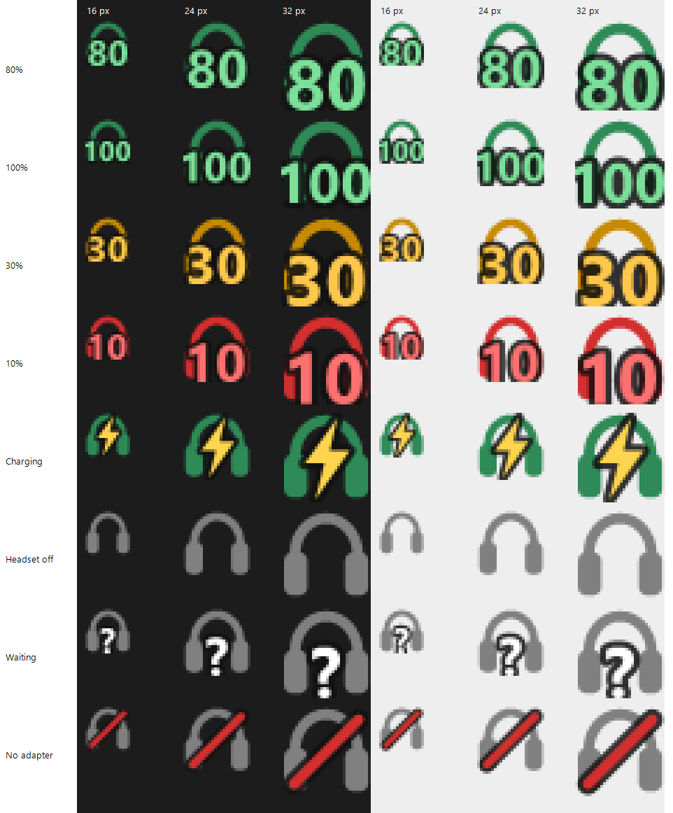
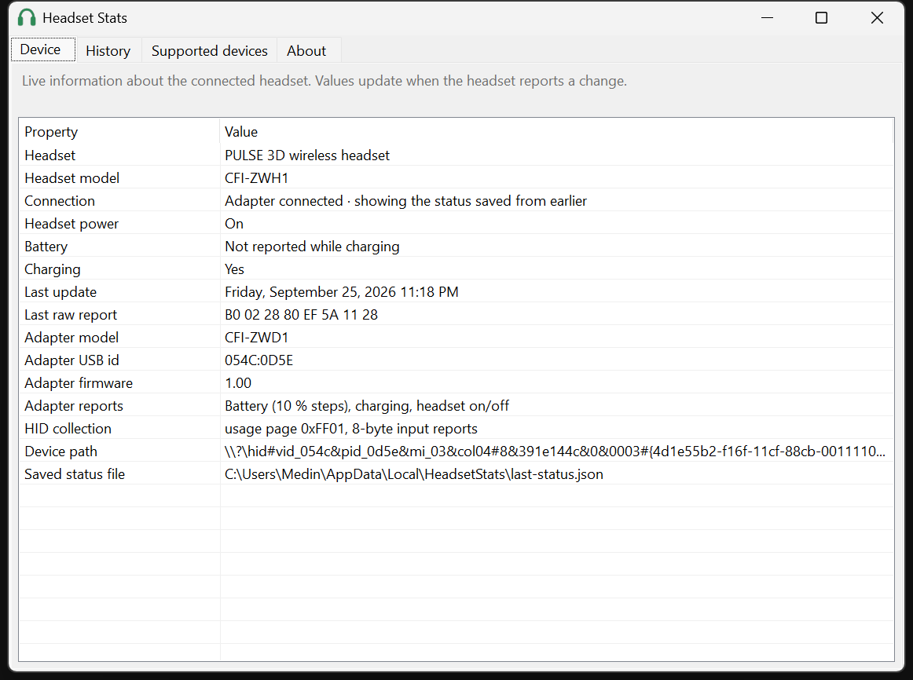

# Headset Stats

See your wireless headset's battery level on your PC, starting with the **PlayStation PULSE 3D**
wireless headset on Windows.

Windows treats the PULSE 3D's USB adapter as a plain audio device, so it never shows the headset's
battery. Headset Stats reads the adapter's status messages and puts the level in your system tray.



> **Status: early development.** Battery, charging and on/off state work for the PULSE 3D on Windows.



## Features

- **Battery level** in the tray: green above 30 %, amber at 30 % and below, red at 15 % and below
- **Low-battery notification** at 15 %
- **Charging indicator** (⚡) and **headset off** state
- **Remembers the last status** across restarts. The adapter only reports changes, so the app shows
  the last known state with its time until a new report arrives.
- **Device details window** (double-click the tray icon): live headset and adapter information, a history
  of every status report with its raw bytes, the list of supported devices, and an About page explaining
  how the data is gathered and what to expect
- Start with Windows (optional)
- Offline, no telemetry, no third-party dependencies

## Supported devices

| Headset | Adapter (USB id) | Battery | Charging | On/off |
|---|---|---|---|---|
| PULSE 3D wireless headset (CFI-ZWH1) | CFI-ZWD1 (`054C:0D5E`) | ✅ 10 % steps | ✅ | ✅ |

Own a headset that isn't listed? See [Adding a headset](#adding-a-headset).

### Known limitations (PULSE 3D)

- The level is reported in **10 % steps** and is a voltage estimate. It can read high for a minute
  after unplugging the charging cable.
- **No level is reported while charging**; the app shows ⚡ and the last known level.
- The adapter sends status **only when something changes** (headset switched on or off, cable plugged
  or unplugged, adapter plugged in), and the PC can't ask for it. If the icon shows "?", switch the headset off and on.

## Platforms

| Folder | Platform | Status |
|---|---|---|
| [`windows/`](windows/) | Windows 10/11 tray app (.NET 9) | ✅ Working, Microsoft Store release planned |
| [`macos/`](macos/) | macOS menu bar app (Swift) | Planned |
| [`linux/`](linux/) | Linux tray app | Planned |
| [`android/`](android/) | Android app (Kotlin, USB host) | Planned |

All platforms share one protocol description: [`docs/PROTOCOL.md`](docs/PROTOCOL.md).

## Build (Windows)

Requires the [.NET 9 SDK](https://dotnet.microsoft.com/download) (`winget install Microsoft.DotNet.SDK.9`).

```
cd windows
dotnet build
dotnet test
dotnet run --project src/HeadsetStats.Tray
```

More in [`windows/README.md`](windows/README.md).

## How it works

The PULSE 3D's USB adapter exposes a vendor-specific HID interface next to its audio interface.
Whenever the headset's state changes, the adapter sends an 8-byte report `0xB0`. Byte 3 is the
battery level (or `0x80` while charging) and byte 4 says whether the headset is on. The byte
layout was worked out by capturing these reports while switching the headset on and off and
plugging the cable in and out. See [`docs/PROTOCOL.md`](docs/PROTOCOL.md) for the full layout and raw captures.

## Adding a headset

1. Run the read-only probe while switching your headset on and off and plugging the charging cable in and out:
   ```
   cd windows
   dotnet run --project src/HeadsetStats.Probe -- list
   dotnet run --project src/HeadsetStats.Probe -- listen <VID>:<PID> 300
   ```
2. Open an issue with the output, your headset model, and what you did at each timestamp.
3. Or implement it yourself: add an `IHeadsetProtocol`, tests with your captured reports, and a
   section in `docs/PROTOCOL.md`.

## Contributing

**The project is open to contributions!** Headset captures, bug reports, code, docs, and the
macOS, Linux and Android apps are all welcome, and you don't need to write code to get your
headset supported. See [CONTRIBUTING.md](CONTRIBUTING.md) to get started.

## Privacy

Headset Stats collects no data and makes no network connections. See [PRIVACY.md](PRIVACY.md).

## License

[MIT](LICENSE) © 2026 Medin Piranej

---

*Not affiliated with or endorsed by Sony Interactive Entertainment. PlayStation, PULSE, PULSE 3D
and PULSE Elite are trademarks of Sony Interactive Entertainment Inc., used here only to
identify compatible hardware.*
