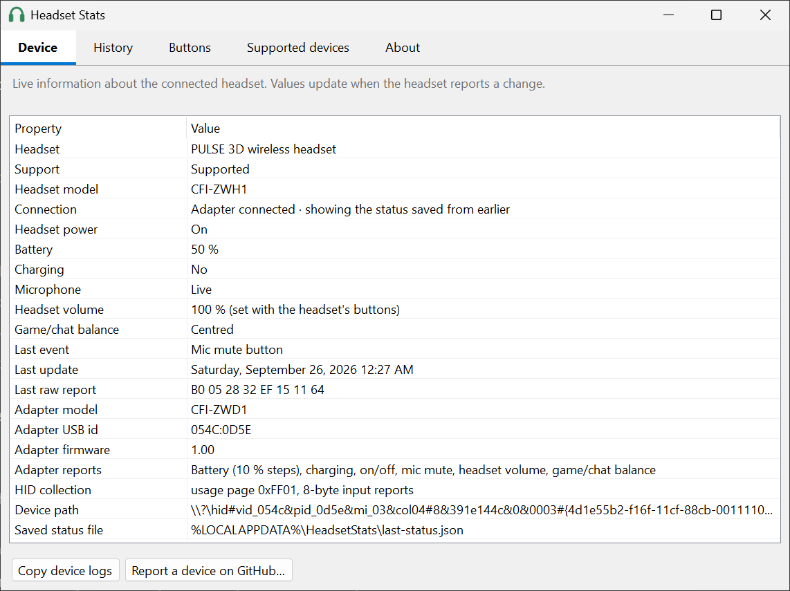

# Headset Stats

See your wireless headset's battery, charging, mic and button status on your PC, starting with the
**PlayStation PULSE 3D** wireless headset on Windows 10 and 11.

Windows treats the PULSE 3D's USB adapter as a plain audio device, so it never shows the headset's
battery. Headset Stats reads the adapter's status messages and puts everything in your system tray.

**[Website](https://medinpiranej.github.io/headset-stats/)** ·
**[Join the beta](#join-the-beta-microsoft-store)** ·
**[Sponsor](https://github.com/sponsors/medinpiranej)** ·
[Contributing](CONTRIBUTING.md) · [Privacy](PRIVACY.md)

> **Status: beta (v0.2.1).** On Windows, the PULSE 3D's battery, charging, on/off, mic mute, volume,
> game/chat balance and button presses all work. Other Sony headsets can be tried experimentally.

<picture>
  <source media="(prefers-color-scheme: dark)" srcset="docs/screenshots/window-device-dark.png">
  
</picture>

### Tray icon


Shown at 32 px, the largest tray size. The icon is vector-drawn, so every size Windows uses (16, 20, 24
and 32 px, for any display scaling) comes out sharp. `HeadsetStats.exe --render-icons icons.png all`
renders every state at 16, 24 and 32 px.

## Join the beta (Microsoft Store)

Headset Stats is being submitted to the **Microsoft Store as a free beta for Windows 10 (1809+) and
Windows 11**.

1. **Install**: open **[Headset Stats in the Microsoft Store](https://apps.microsoft.com/detail/9P8NLJ432R5R)** and click
   **Get** (the page goes live once Microsoft approves the beta). Or, from a terminal: `winget install 9P8NLJ432R5R`.
   Updates arrive automatically.
2. **Use it** with your headset for a few days.
3. **Tell us how it goes**: [open an issue](https://github.com/medinpiranej/headset-stats/issues/new/choose).
   In the app, **Copy device logs** (bottom of the window or the tray menu) gives us everything we need.
   Headsets that aren't supported yet are especially welcome: use *Report a device on GitHub…*.

Can't wait? Download the latest build from [GitHub Actions](https://github.com/medinpiranej/headset-stats/actions)
(*Artifacts* of the newest run), unzip it and run `HeadsetStats.exe`. The zip needs the .NET 9 Desktop Runtime:
`winget install Microsoft.DotNet.DesktopRuntime.9`.

## Features

- **Battery level** in the tray: green above 30 %, amber at 30 % and below, red at 15 % and below
- **Low-battery notification** at 15 %
- **Charging indicator** (⚡), **headset off** state, and a **mic muted** badge
- **"Settling" after charging**: the headset reports too high a level right after charging, so the icon
  turns grey until the reading is reliable again
- The headset's own **volume** and **game/chat balance**, plus the **last button pressed**
- **Remembers the last status** across restarts. The adapter only reports changes, so the app shows the
  last known state with its time until a new report arrives.
- **Device window** (double-click the tray icon): Device, History, Buttons, Supported devices and About tabs
- **Chat / Game button actions**: make the headset's Chat or Game button open any shortcut, app, file or
  website, or run your own command (in addition to changing the headset's balance)
- **Light and dark mode**, following your Windows setting
- **Every value is selectable and copyable** (Ctrl+C, right-click → Copy), plus **Copy device logs** for bug reports
- **Open to new headsets**: other Sony headsets can be tried in an experimental, listen-only mode (see below)
- Start with Windows (optional)
- Offline: no account, no ads, no telemetry, no third-party dependencies

## Supported devices

| Headset | Adapter (USB id) | Battery | Charging | On/off | Mic / volume / buttons |
|---|---|---|---|---|---|
| PULSE 3D wireless headset (CFI-ZWH1) | CFI-ZWD1 (`054C:0D5E`) | ✅ 10 % steps | ✅ | ✅ | ✅ (not the monitor button) |
| Other Sony headsets | `054C:*` | 🧪 experimental | 🧪 | 🧪 | 🧪 |

🧪 **Not supported yet, but you can try it.** With no supported adapter plugged in, the app listens
(read-only) to other Sony devices, marks them *"Not supported yet (experimental)"* and tries the PULSE 3D
format, which similar Sony adapters may share. Controllers like the DualSense are skipped. **Tell us whether it
works**: press *Report a device on GitHub…* in the app. It copies the device logs and opens a ready-made issue.
See [CONTRIBUTING.md](CONTRIBUTING.md#try-the-app-with-your-headset-no-coding-needed).

The headset's sound and mic use Windows' built-in USB audio driver, so they work on any Windows. The app
needs Windows 10 (1809+) or 11.

### Known limitations (PULSE 3D)

- The level is reported in **10 % steps** and is a voltage estimate.
- **Right after charging it reads too high** (e.g. 100 % that is really 50 %). The app greys the icon and
  marks the value "settling" until the headset reconnects. Switch it off and on for an accurate reading.
- **No level is reported while charging**; the app shows ⚡ and the last known level.
- The adapter sends status **only when something changes** (a button, switched on or off, cable plugged
  or unplugged, adapter plugged in), and the PC can't ask for it. If the icon shows "?", switch the headset off and on.
- Volume, mute and game/chat act **inside the headset**: the app shows them but Windows' volume is unaffected.
  The **monitor** button isn't reported to the PC.

## Platforms

| Folder | Platform | Status |
|---|---|---|
| [`windows/`](windows/) | Windows 10/11 tray app (.NET 9) | ✅ Beta, Microsoft Store submission in progress |
| [`macos/`](macos/) | macOS menu bar app (Swift) | Planned |
| [`linux/`](linux/) | Linux tray app | Planned |
| [`android/`](android/) | Android app (Kotlin, USB host) | Planned |

All platforms share one protocol description: [`docs/PROTOCOL.md`](docs/PROTOCOL.md).

## Build locally (Windows)

Requires the [.NET 9 SDK](https://dotnet.microsoft.com/download) (`winget install Microsoft.DotNet.SDK.9`).

```
git clone https://github.com/medinpiranej/headset-stats
cd headset-stats/windows
.\build.ps1
```

`build.ps1` builds, runs the tests and packages the app into `artifacts\` (a folder and a ~220 KB zip).
`.\build.ps1 -Msix` also builds the Microsoft Store package (needs the Windows SDK). Options, quick dev
commands and the probe tool are in [`windows/README.md`](windows/README.md#build-locally).

## How it works

The PULSE 3D's USB adapter exposes a vendor-specific HID interface next to its audio interface. Whenever
something changes, the adapter sends an 8-byte report `0xB0`: battery (or `0x80` while charging), power and
mic flags, headset volume, game/chat balance, and an event code saying what happened (volume up, chat
button, switched off, …). The layout was worked out by recording these reports while pressing each button,
switching the headset on and off and plugging the cable in and out. See [`docs/PROTOCOL.md`](docs/PROTOCOL.md)
for the full layout and raw captures.

## Adding a headset

The easiest way: [try the app with your headset](CONTRIBUTING.md#try-the-app-with-your-headset-no-coding-needed)
and send us the device logs. For deeper captures, use the read-only probe tool:

```
cd windows
dotnet run --project src/HeadsetStats.Probe -- list
dotnet run --project src/HeadsetStats.Probe -- log <VID>:<PID> capture.log
```

Or implement it yourself: add an `IHeadsetProtocol`, tests with your captured reports, and a section in
`docs/PROTOCOL.md`.

## Contributing

**The project is open to contributions!** Headset captures, bug reports, code, docs, and the
macOS, Linux and Android apps are all welcome, and you don't need to write code to get your
headset supported. See [CONTRIBUTING.md](CONTRIBUTING.md) to get started.

## Support the project

Headset Stats is free and always will be. If it's useful to you, you can support its development
through **[GitHub Sponsors](https://github.com/sponsors/medinpiranej)**. Starring the repo, joining
the beta and reporting your headset help too.

## Privacy

Headset Stats collects no data and makes no network connections. See [PRIVACY.md](PRIVACY.md).

## License

[MIT](LICENSE) © 2026 Medin Piranej

---

*Not affiliated with or endorsed by Sony Interactive Entertainment. PlayStation, PULSE, PULSE 3D
and PULSE Elite are trademarks of Sony Interactive Entertainment Inc., used here only to
identify compatible hardware.*
